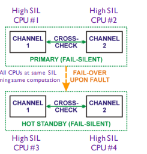
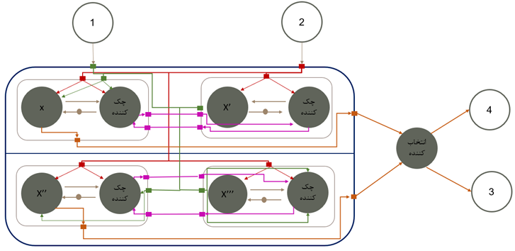
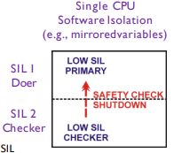
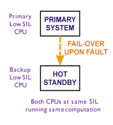
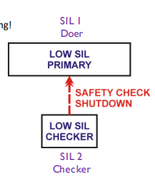
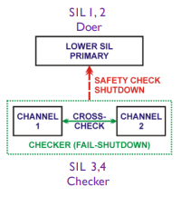
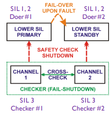

# TITLE: Navigating the Complexity: Adaptive Safe Mapping Strategies for Real-Time Streaming on Multi-Processor Architectures

In this thesis, conducted by Farnoush Bahrami under the guidance of Professor Seyed  Hossein Attarzadeh-Niaki, we systematically investigate the optimization of mapping strategies for real-time streaming applications on multi-processor systems through constraint programming. This research is predicated on the foundational methodologies delineated in the DeSyDe Paper, acknowledging the substantial contributions of prior works in shaping the direction of this study.
Central to our methodological approach is Homogeneous Synchronous Data Flow Graphs (HSDFGs), which provide a structured representation of the complex interactions and data flows within streaming applications. In an innovative extension of this model, we have incorporated Koopman's safety patterns to enhance the inherent reliability and safety mechanisms of the system. This integration not only contributes to the robustness of the computational model but also addresses critical aspects of resource allocation and operational safety in multi-core processing environments.
# In-Depth Code Analysis
Welcome to an overview of my project's codebase, a key element of my thesis that highlights my commitment to safety and modern software development practices. In this section, I outline the safety patterns implemented, how the code is organized across different directories, and the progress of my thesis work. 
# Safety Patterns Implemented:
### high SIL fail-operational pattern

#### Modified Version

### low SIL Doer Checker pattern

#### Modified Version

### low SIL fail Operational patterns

#### Modified Version

### low SIL fail Silent Hardware pattern

#### Modified Version

### mixed SIL fail Silent pattern

#### Modified Version

### mixed SIL high Availability pattern

#### Modified Version

# Code Organization:
 **The project is organized as follows:**
#### [attarfieti/todaes17+f.mzn](https://github.com/farnoushBahrami/mapping/blob/main/attarfieti/todaes17%2Bf.mzn):
**Lines 139-260:** This section showcases the implementation of various safety patterns.
**Lines 263-370:** Focuses on the implementation of cost calculations.
#### [attarfieti/bus.mzn](https://github.com/farnoushBahrami/mapping/blob/main/attarfieti/Bus.mzn):
This file is dedicated to the implementation of bus considerations.
 
# Objectives
Ensure Performance Requirements: Develop mapping strategies that guarantee the fulfillment of minimum throughput and latency requirements for real-time streaming applications. This involves optimizing the allocation of computational resources and tasks across multi-processor systems to ensure that the applications can process data streams within the required time frames, maintaining the integrity and responsiveness of real-time operations.
**Minimize Mapping Costs:** Aim to minimize the costs associated with achieving safe mapping configurations, including the reduction of development costs. This encompasses not only reducing computational overhead and energy consumption but also streamlining the development process to decrease the time and resources required for creating and implementing mapping strategies. By optimizing the development lifecycle and minimizing resource wastage, this objective seeks to enhance the economic efficiency of the system alongside balancing the performance and safety requirements of real-time applications.
**Enhance Safety: ** Incorporate safety patterns, specifically Koopman's safety patterns, into the mapping process to ensure that the system's operation adheres to established safety standards. This objective focuses on integrating robust safety mechanisms into the HSDFG-based models, thereby mitigating risks and enhancing the reliability of the system under various operational conditions.

# Technologies Used
**MiniZinc:** MiniZinc is a high-level constraint modeling language used for defining and solving constraint satisfaction and optimization problems. It is the primary tool used in this project for implementing the constraint programming aspects of the mapping strategies.

# installation
This project is developed using MiniZinc, a high-level constraint modeling language, which interfaces with various solvers to find solutions to optimization and constraint satisfaction problems. The primary solver used is Google OR-Tools, but the framework allows for the use of alternative solvers supported by MiniZinc.

**Installing MiniZinc**
**Download MiniZinc:*** Go to the MiniZinc website and download the MiniZinc IDE for your operating system.
**Install MiniZinc:** Follow the installation instructions provided on the website or within the downloaded package to install MiniZinc on your system.
**Setting Up Google OR-Tools Solver**
**Install Google OR-Tools:** Although Google OR-Tools may come pre-installed with MiniZinc, ensure it is available by checking the list of solvers in the MiniZinc IDE. If not present, follow the instructions on the Google OR-Tools website to install it and integrate it with MiniZinc.
Select Google OR-Tools as the Solver: In the MiniZinc IDE, select Google OR-Tools from the list of available solvers before running your model.
Using Alternative Solvers
MiniZinc supports a variety of solvers, allowing for flexibility in how optimization problems are approached. To use an alternative solver:

# Features
Implementation of Koopman's Safety Patterns
**Safety Patterns Integration:** The project incorporates Koopman's safety patterns, as detailed in his embedded system lectures, to enhance the reliability of the mapping strategies. Each cross-check within the system is paired with a corresponding checker module that monitors the input and output data of the 'Doer' entities, ensuring the integrity and accuracy of operations.
**Research-Driven Cost Analysis for Safety Levels:**  (i don't remember the name of paper:|)  leverages in-depth research to meticulously calculate and minimize the development costs associated with implementing safety patterns, specifically across varying Safety Integrity Levels (SILs). By quantifying the investment required to design applications with integrated safety considerations, the aim is to delineate cost-effective methodologies that do not compromise on system safety. This strategic analysis is pivotal in achieving an equilibrium between the imperative of system safety and the economic efficiency of the development process. The intent is to ensure that the deployment of safety measures in real-time streaming applications on multiprocessor systems is both financially viable and adherent to the highest safety standards.

# Advanced HSDFG Configuration
**Redundancy Mapping Array:** A specialized array structure records the redundancy of actors within the HSDFG, providing a clear overview of the system's fault tolerance at various stages of the streaming process.
**Extended HSDFG Array:** The HSDFG is extended to integrate safety patterns and cost considerations. This array details the augmented elements and their interconnections, offering a comprehensive view of the enhanced system model.

**This integration of Koopman's safety patterns into the HSDFG framework is a key feature of the project, ensuring that the mapping of real-time streaming applications onto multiprocessor systems not only meets performance requirements but also adheres to rigorous safety standards.**

# **Acknowledgments**
Special thanks to Professor Seyed Hossein Attarzadeh-niaki for his invaluable guidance and support throughout this project. Additional gratitude goes to all who contributed to the development and refinement of this research.

